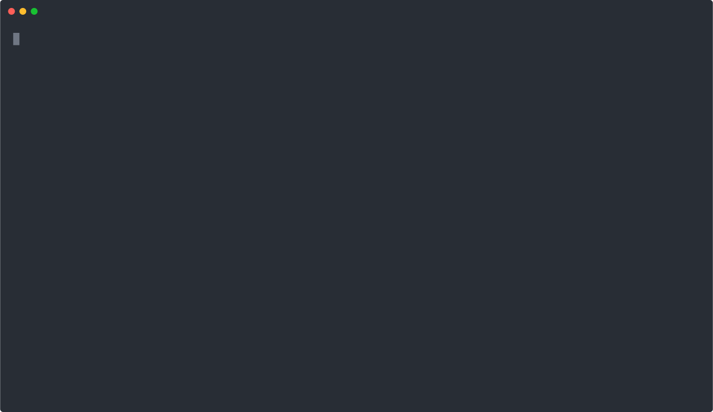

## 📦 `wukong-deploy`

<p align="center">
  
</p>

<p align="center">
  <a href="https://www.npmjs.com/package/wukong-deploy"></a>
  <a href="https://www.npmjs.com/package/wukong-deploy"></a>
  <a href="https://github.com/tomatobybike/wukong-deploy/blob/master/LICENSE"></a>
  <a href="https://github.com/tomatobybike/wukong-deploy"></a>
  <a href="https://github.com/tomatobybike/wukong-deploy/issues"></a>
</p>

> ⚡️ A lightweight Node.js CLI for remote server deployment — run any command queue with a single line.

English | [简体中文](./README.zh-CN.md)

---

## 📚 Table of Contents

- [📦 `wukong-deploy`](#-wukong-deploy)
- [📚 Table of Contents](#-table-of-contents)
- [✨ Features](#-features)
- [🧱 Requirements](#-requirements)
- [📦 Installation](#-installation)
- [🚀 Usage](#-usage)
  - [CLI Commands](#cli-commands)
- [⚙️ Configuration](#️-configuration)
  - [`config/config.mjs`](#configconfigmjs)
- [➕ Adding Multiple Servers](#-adding-multiple-servers)
- [🌱 Environment Variables](#-environment-variables)
  - [Example `.env`](#example-env)
- [📷 Demo](#-demo)
- [🖥 Supported Platforms](#-supported-platforms)
- [📦 Upgrade](#-upgrade)
- [🌏 Multi-language Support](#-multi-language-support)
- [📜 Changelog](#-changelog)
- [🐛 Troubleshooting](#-troubleshooting)
- [📄 License](#-license)
- [🔍 Keywords](#-keywords)

---

## ✨ Features

- 🚀 One-command deployment to remote servers
- 🔐 Secure SSH + SCP support
- 📁 Custom file/folder inclusion
- 📦 Easily configurable with `config.mjs` and `.env`
- 🌍 Multilingual CLI: English / 简体中文
- 🧪 Robust stderr error matching

---

## 🧱 Requirements

- Node.js >= 18.0.0
- Linux / macOS (recommended)
- Windows

---

## 📦 Installation

```bash
npm install -g wukong-deploy
# or
yarn global add wukong-deploy
```

---

## 🚀 Usage

### CLI Commands

```bash
wukong-deploy init       # Generate .env and config/config.mjs
wukong-deploy deploy     # Interactive deployment
wukong-deploy deploy dev # Deploy using specific server key
```

Set environment variables on the fly:

```bash
WUKONG_LANG=en WUKONG_DEBUG=1 wukong-deploy deploy
```

---

## ⚙️ Configuration

### `config/config.mjs`

```js
export default {
  showCommandLog: true,
  servers: {
    dev: {
      name: 'Dev Server',
      host: '192.168.0.123',
      username: 'root',
      passwordEnv: 'SERVER_DEV_PASSWORD',
      commands: [
        {
          cmd: 'git pull',
          cwd: '/your/project',
          description: 'Update code',
          exitOnStdErr: false,
          errorMatch: /Permission denied/
        },
        {
          cmd: 'npm run build',
          cwd: '/your/project',
          description: 'Build project',
          exitOnStdErr: false,
          errorMatch: /Permission denied/
        }
      ],
      finishMsg: '🎉 Deployment completed'
    }
  }
}
```

---

## ➕ Adding Multiple Servers

To deploy to more environments, simply add more entries in the `servers` field:

```js
export default {
  servers: {
    dev: {
      /* ... */
    },
    staging: {
      name: 'Staging Server',
      host: '123.45.67.89',
      username: 'deploy',
      passwordEnv: 'SERVER_STAGING_PASSWORD',
      commands: [
        {
          cmd: 'npm run build',
          cwd: '/srv/app',
          description: 'Build app',
          exitOnStdErr: false,
          errorMatch: /Permission denied/
        }
      ],
      finishMsg: '🚀 Staging deployment done'
    },
    prod: {
      /* ... */
    }
  }
}
```

Then, define each server's password (or other secrets) in your `.env` file:

```env
SERVER_DEV_PASSWORD=your_dev_password
SERVER_STAGING_PASSWORD=your_staging_password
SERVER_PROD_PASSWORD=your_prod_password
```

To deploy to a specific server:

```bash
wukong-deploy deploy staging
```

---

## 🌱 Environment Variables

You can define these variables in `.env`, or export them in `.bashrc` / `.zshrc`:

| Variable          | Description                 | Example |
| ----------------- | --------------------------- | ------- |
| `WUKONG_DEV_MODE` | Enable verbose/dev mode     | `1`     |
| `WUKONG_LANG`     | CLI language (`zh` or `en`) | `zh`    |
| `WUKONG_NO_EMOJI` | Disable emoji output        | `1`     |
| `WUKONG_DEBUG`    | Enable internal debug logs  | `1`     |

💡 `WUKONG_NO_EMOJI`: 某些 Windows 终端（如旧版 CMD）对 emoji 显示不友好，建议设置为 `1` 禁用。

### Example `.env`

```env
WUKONG_DEV_MODE=1
WUKONG_LANG=zh
WUKONG_NO_EMOJI=1
WUKONG_DEBUG=1

# Server login credentials
SERVER_DEV_PASSWORD=your_password
SERVER_STAGING_PASSWORD=your_password
```

---

## 📷 Demo

```bash
wukong-deploy deploy
```



---

## 🖥 Supported Platforms

- macOS
- Linux
- Windows（需安装 Git Bash）

---

## 📦 Upgrade

```bash
npm update -g wukong-deploy
# or
yarn global upgrade wukong-deploy
```

---

## 🌏 Multi-language Support

Automatically switches between Chinese and English based on your terminal's system language, no extra configuration needed.

| Language Environment Variable | Language |
| ----------------------------- | -------- |
| `LANG=zh_CN.UTF-8`            | Chinese  |
| `LANG=en_US.UTF-8`            | English  |

You can also force the language via command-line argument:

```bash
wukong-deploy --lang=zh   # 强制中文
wukong-deploy --lang=en   # Force English
```

Or configure it in your `.env` file similarly:

```bash
wukong-deploy --lang=zh   # 强制中文
wukong-deploy --lang=en   # Force English
```

---

## 📜 Changelog

See [CHANGELOG.md](./CHANGELOG.md) for release history.

---

## 🐛 Troubleshooting

- **Garbled characters in Windows terminal**: It is recommended to use a UTF-8 capable terminal, such as Windows Terminal.
- **Emoji not displaying**: Set `WUKONG_NO_EMOJI=1`
- **Server login failure**:

  - Please verify that the password in `.env` and the username in `config/config.mjs` are correct.

---

## 📄 License

[MIT](./LICENSE)

---

## 🔍 Keywords

<!-- cli, deploy, deployment, ssh ,multi-server ,automation ,javascript, nodejs ,command-line ,script ,frontend ,remote server, server management ,server deployment -->
